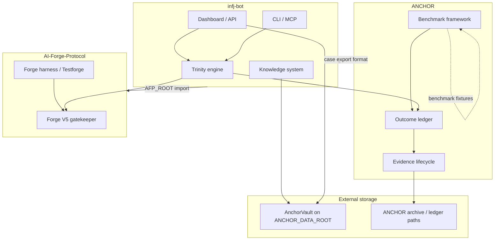
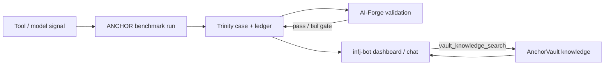
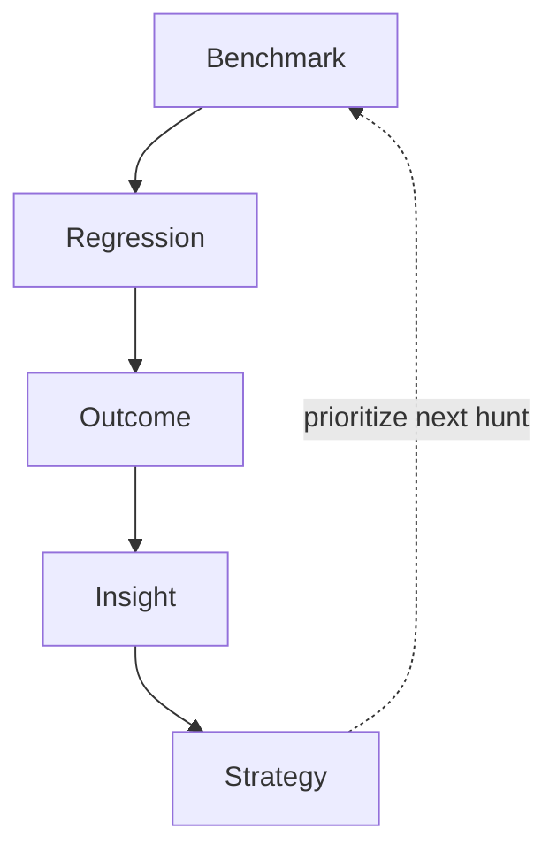

# Portfolio Architecture

Definitive reference for **where code lives**, **how data flows**, and **who owns what**. Read this before adding a feature, copying a script, or deleting a local directory.

Related docs:

- [ROADMAP.md](ROADMAP.md) — engineering phases, Phase C priorities, exit criteria
- [REPO_CONSOLIDATION_PLAN.md](docs/REPO_CONSOLIDATION_PLAN.md) — GitHub tiers, archive list, phase history
- [SCRIPT_REUSE_MAP.md](docs/SCRIPT_REUSE_MAP.md) — script-level extraction map

---

## Canonical components

Each capability has **one owner repo**. Do not re-implement in a sibling repo; import, call, or document a dependency instead.

### ANCHOR

**GitHub:** [timeless-hayoka/ANCHOR](https://github.com/timeless-hayoka/ANCHOR)  
**Local:** `/home/crexs/ANCHOR`

| Owns | Does not own |
|------|----------------|
| Benchmark framework (DVD, Ethernaut, SCabench adapters) | Trinity chat / companion UI |
| Outcome ledger and case artifacts | Forge syntax gatekeeper |
| Evidence lifecycle (claim → reproduce → sign) | Long-term knowledge corpus storage |
| `anchor_cli.py`, `anchor_server.py`, `anchor_storage.py` | Dashboard front-end (lives in infj-bot) |

**External data:** benchmark corpora under `ANCHOR/benchmarks/`; archived outcomes on `ANCHOR_DATA_ROOT` / AnchorVault when configured.

---

### AI-Forge-Protocol

**GitHub:** [timeless-hayoka/AI-Forge-Protocol](https://github.com/timeless-hayoka/AI-Forge-Protocol)  
**Local:** `/home/crexs/AI-Forge-Protocol`

| Owns | Does not own |
|------|----------------|
| Forge validation harness (`src/forge_harness.py`) | Trinity caseflow / ANCHOR ledger |
| **Forge V5 gatekeeper** (`src/forge_v5_gatekeeper.py`, `scripts/forge_v5_gatekeeper.py`) | ANCHOR benchmark runners |
| Testforge / tournament / perturbation pipeline | infj-bot web dashboard |
| Patch-gating and reliability metrics | AnchorVault knowledge files |

**Env:** `AFP_ROOT` → repo root. Consumers (infj-bot) import via `core/forge_gate.py` shim.

---

### infj-bot

**GitHub:** [timeless-hayoka/infj-bot](https://github.com/timeless-hayoka/infj-bot) — default branch **`anchor`**  
**Local:** `/home/crexs/infj_bot` (underscore — canonical)

| Owns | Does not own |
|------|----------------|
| Trinity engine (`drift/trinity/`) | ANCHOR CLI / standalone proof gate |
| Dashboard & HTTP API (`interfaces/api.py`, anchor dashboard) | Forge V5 gatekeeper implementation |
| CLI / TUI / companion runtime | AI-Forge tournament harness |
| Knowledge integration (AnchorVault paths, Chroma, vault search) | Raw benchmark fixture repos (ANCHOR) |
| MCP tools (`core/mcp_server.py`) | Outcome ledger schema (ANCHOR + Trinity share; ANCHOR is source for benchmark runs) |

**Env:** `ANCHOR_DATA_ROOT`, `ANCHOR_VAULT_ROOT`, `DRIFT_ROOT` / `INFJ_BOT_ROOT`, `AFP_ROOT`.

**Legacy docs:** private drift repos merged under `docs/legacy/` (read-only archive).

---

## Supporting repos (thin, no overlap with core trio)

| Repo | Role |
|------|------|
| [LOTUS-ACADEMY](https://github.com/timeless-hayoka/LOTUS-ACADEMY) | Training UI and labs |
| [bounty-bot](https://github.com/timeless-hayoka/bounty-bot) | Bounty workflow + fidelity runner |
| [cyber-tools](https://github.com/timeless-hayoka/cyber-tools) | Small scoped utilities |
| [llm-minify](https://github.com/timeless-hayoka/llm-minify) | Prompt/token minimization |
| [crex](https://github.com/timeless-hayoka/crex) | Cognitive middleware hooks consumed by infj-bot |

---

## Dependency diagram



---

## Data flow



1. **Benchmark** — ANCHOR runs authorized corpora; writes structured outcomes.
2. **Case** — Trinity ingests evidence, DMU scoring, council/forge schema (infj-bot).
3. **Validation** — AI-Forge-Protocol gatekeeper checks generated code before promotion.
4. **Knowledge** — AnchorVault on disk; infj-bot resolves paths via `config_adapter` / `anchor_context`.
5. **Surface** — Dashboard and chat expose snapshot, paths, and search (port 8765 by default).

---

## Ownership rules

1. **One home per feature** — If it appears in two repos, delete the copy or replace with an import + link in ARCHITECTURE.md.
2. **ANCHOR owns proof** — Anything that must be reproducible for security research outcomes lives in or is invoked by ANCHOR.
3. **AI-Forge owns gates** — Syntax validation, harness tournaments, and patch-gating metrics stay in AFP.
4. **infj-bot owns experience** — UI, agent loop, memory, MCP, Trinity orchestration stay in infj-bot.
5. **No hardcoded `/home/crexs/...` paths** — Use `AFP_ROOT`, `DRIFT_ROOT`, `ANCHOR_DATA_ROOT`, or package install.
6. **Vault is not git** — Knowledge corpus and Chroma data live on `ANCHOR_DATA_ROOT`; never commit them.
7. **Legacy is read-only** — `docs/legacy/` in infj-bot is archive; new docs go in active trees.
8. **Trends are canonical** — Historical benchmark comparison lives in `ANCHOR/anchor_trends.py`. Dashboard, strategy, and reports consume it; do not reimplement trend math elsewhere.
9. **No new top-level repos** — Extend ANCHOR, AI-Forge-Protocol, infj-bot, or timeless-hayoka. See [ROADMAP.md](ROADMAP.md).

---

## Canonical local paths

| GitHub repo | Canonical directory | Retired duplicate (hold ~2 weeks) |
|-------------|---------------------|-----------------------------------|
| infj-bot | `/home/crexs/infj_bot` | `/home/crexs/infj-bot.retired.20260627` |
| AI-Forge-Protocol | `/home/crexs/AI-Forge-Protocol` | `/home/crexs/ai_forge_protocol.retired.20260627` |
| ANCHOR | `/home/crexs/ANCHOR` | — |
| LOTUS-ACADEMY | `/home/crexs/LOTUS-ACADEMY` (prefer clean tree) | `/home/crexs/lotus-academy` if bloated |

Before deleting a retired tree, re-run:

```bash
./scripts/verify_duplicate_repo_deps.sh
```

---

## Branch policy: `anchor` vs `master`

**Default branch on GitHub:** `anchor` (active development).

**Do not merge `anchor` → `master` until all are true:**

- [ ] CI / pytest green on `anchor` (excluding known flaky/integration skips)
- [ ] README and quickstart match running behavior (vault paths, ports, env vars)
- [ ] No debug artifacts staged (logs, `.benchmarks/`, venv, ablation dumps)
- [ ] No experimental code without feature flag or doc callout
- [ ] ARCHITECTURE.md and repo READMEs agree on ownership

If any item fails, keep maturing on `anchor`. Merging is a release decision, not a hygiene shortcut.

---

## Phase C — Operational maturity

Next major milestone: closed loop from benchmark to strategy. **Complete the learning loop on existing benchmark families before expanding the corpus** (see [ROADMAP.md](ROADMAP.md)).



| Stage | Question | Owner | Phase C deliverable |
|-------|----------|-------|---------------------|
| **Benchmark** | What happened? | ANCHOR | `anchor benchmark trends` |
| **Regression** | What changed? | ANCHOR + AFP | Existing publish + `REGRESSION_REPORT.md` |
| **Outcome** | What was the result? | ANCHOR | Ledger + expanded `anchor outcome insights` |
| **Insight** | Why did it happen? | ANCHOR + infj-bot | Recurring causes, lessons with evidence links |
| **Strategy** | What next? | ANCHOR | `anchor strategy` (ROI-ranked recommendations) |

Phase C priorities (in order):

1. **`anchor benchmark trends`** — ✅ shipped in `anchor_trends.py` (CLI + HTTP; canonical historical source).
2. **`anchor strategy`** — ROI-ranked recommendations; consumes trends + outcome ledger.
3. **`anchor outcome insights`** — expand beyond counts to recurring causes and lessons (partial today).
4. **Independent reproduction guide** — fresh machine reproduces one published benchmark (credibility milestone).

Deferred to **Phase D**: new benchmark families, cross-benchmark analytics, adaptive prioritization at scale.

---

## When in doubt

| Question | Answer |
|----------|--------|
| Where does a new benchmark adapter go? | ANCHOR |
| Where does syntax validation for LLM output go? | AI-Forge-Protocol |
| Where does a dashboard panel go? | infj-bot |
| Can I copy `forge_v5_gatekeeper.py`? | No — depend on AFP |
| Which infj-bot folder is canonical? | `infj_bot` with underscore |
| Safe to delete retired duplicate? | Only after ~2 weeks and `verify_duplicate_repo_deps.sh` is clean |
| Where is the phase plan? | [ROADMAP.md](ROADMAP.md) |

---

*Last updated: 2026-06-27 — Phase B complete; duplicate trees retired; Phase C in progress.*
